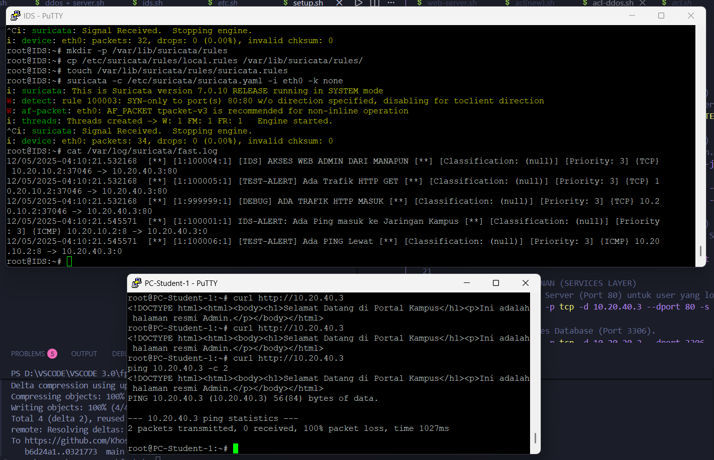
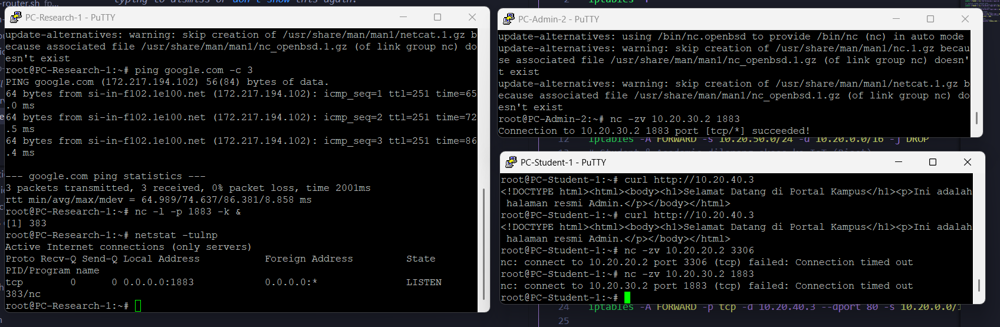
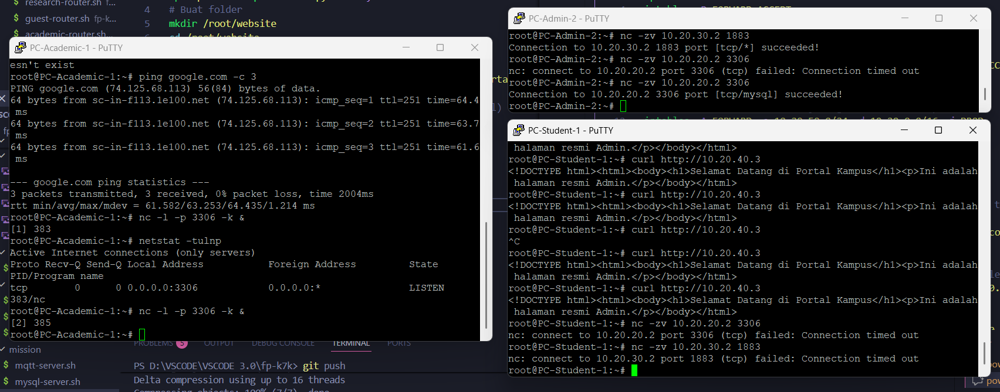
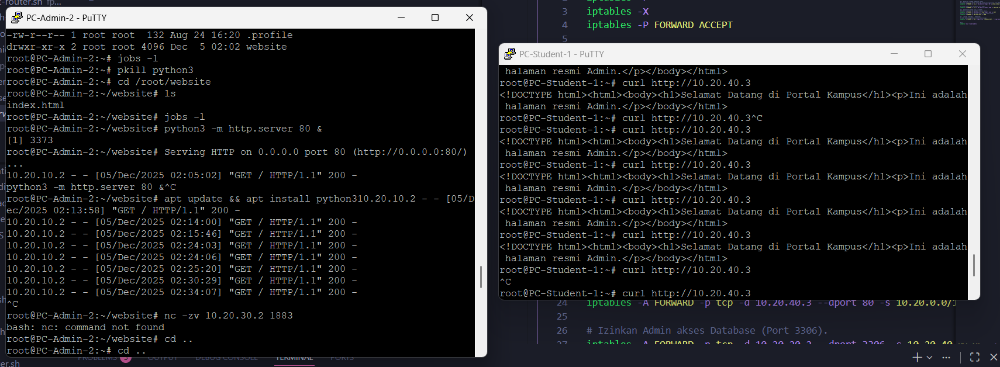

# Deteksi Serangan Menggunakan IDS Suricata

---
## Anggota Kelompok
| Nama | NRP |
|------|------|
| Oryza Qiara Ramadhani | 5027241084 |
| Ahmad Syauqi Reza | 5027241085 |
| Muhammad Khosyi Syehab | 5027241089 |
| Muhammad Ardiansyah Tri Wibowo| 5027241091 |
---

## Mata Kuliah: Keamanan Jaringan Komputer
---

## 1. Topologi & Penempatan IDS
Posisi IDS: IDS ditempatkan terhubung langsung ke Switch1 (Backbone) dengan IP `172.16.10.100`.

Alasan Pemilihan Posisi: Switch1 merupakan titik pusat lalu lintas antar-subnet (Core Switch). Dengan menempatkan IDS di sini (atau melakukan port mirroring ke arah IDS), IDS memiliki visibilitas penuh terhadap lalu lintas yang menyeberang dari subnet Mahasiswa (`10.20.10.0/24`) menuju subnet Riset (`10.20.30.0/24`). Posisi ini strategis untuk mendeteksi serangan lateral (East-West traffic) di dalam kampus.

---
## 2. Konfigurasi IDS (Suricata)
- Interface Monitoring: eth0 (Mode Promiscuous/IDS)
- Network Variables (suricata.yaml):
```
HOME_NET: "[10.20.0.0/16]" (Mencakup seluruh subnet internal kampus)
EXTERNAL_NET: "!$HOME_NET" (Segala sesuatu di luar jaringan kampus)
```
- Ruleset: Custom Rules (local.rules) difokuskan pada skenario serangan spesifik.
---

## 3. Custom Rules (Aturan Deteksi)
Kami membuat 3 aturan kustom (local.rules) untuk menjawab skenario serangan:                    
**1. Deteksi Port Scanning (Reconnaissance)**                           
``alert tcp any any -> 10.20.30.0/24 any (msg:"MATA-ELANG: Port Scanning Detected (Nmap SYN)"; flags:S; threshold: type both, track by_src, count 10, seconds 20; classtype:attempted-recon; sid:200001; rev:1;)``                          
Logika: Mendeteksi jika satu IP sumber mengirimkan lebih dari 10 paket SYN (permintaan koneksi awal) ke subnet Riset dalam waktu 20 detik. Ini adalah tanda khas alat scanning seperti Nmap yang mencoba memetakan port terbuka secara cepat.                       
**2. Deteksi SSH Brute Force**                                  
``alert tcp any any -> 10.20.30.0/24 22 (msg:"MATA-ELANG: SSH Brute Force Attempt"; flags:S; threshold: type both, track by_src, count 5, seconds 30; classtype:attempted-admin; sid:200002; rev:1;)``                          
Logika: Memonitor trafik ke Port 22 (SSH). Jika terdeteksi lebih dari 5 percobaan inisiasi koneksi (SYN) dari satu IP dalam 30 detik, sistem menganggapnya sebagai upaya paksa (brute force) menggunakan alat seperti Hydra.                                
**3. Deteksi Data Exfiltration (Pencurian Data)**                           
``alert tcp 10.20.30.0/24 80 -> any any (msg:"MATA-ELANG: Data Exfiltration Detected (Keyword: RAHASIA)"; content:"RAHASIA"; nocase; classtype:policy-violation; sid:200003; rev:2;)``                          
Logika: Melakukan Deep Packet Inspection (DPI) pada trafik HTTP yang keluar dari server Riset. Jika payload paket mengandung kata kunci "RAHASIA" (case insensitive), alert akan dipicu. Ini mensimulasikan deteksi dokumen sensitif yang diunduh penyerang.                

---
## 4. Simulasi Serangan & Bukti Deteksi
Berikut adalah hasil simulasi serangan yang dilakukan dari PC Student (10.20.10.3) menuju Server Riset (10.20.30.2).                
                                                    
**A. Serangan Port Scanning**                                                                           
``` 
//Perintah Penyerang:
nmap -Pn -sS -p 1-100 10.20.30.2
```
```
//Log IDS (fast.log):
12/11/2025-16:21:45.358150  [**] [1:200001:1] MATA-ELANG: Port Scanning Detected (Nmap SYN) [**] [Classification: Attempted Information Leak] [Priority: 2] {TCP} 10.20.10.3:47908 -> 10.20.30.10:80
```
Status: TERDETEKSI. IDS berhasil menangkap pola paket SYN beruntun.                                                                                 

**B. Serangan SSH Brute Force**                                     
```
//Perintah Penyerang:
hydra -l root -p password123 ssh://10.20.30.2 -t 4
```
```
//Log IDS (fast.log):
12/11/2025-16:31:06.394501  [**] [1:200002:1] MATA-ELANG: SSH Brute Force Attempt [**] [Classification: Attempted Administrator Privilege Gain] [Priority: 1] {TCP} 10.20.10.3:60648 -> 10.20.30.10:22
``` 
Status: TERDETEKSI. Meskipun serangan gagal menembus password atau koneksi terputus, IDS tetap memberikan peringatan dini (Early Warning) atas upaya akses ilegal tersebut.                                                                                        

**C. Serangan Data Exfiltration**
```
//Perintah Penyerang:
curl http://10.20.30.2/index.html
```
```
//Log IDS (fast.log):
12/11/2025-16:44:01.103889  [**] [1:200003:1] MATA-ELANG: Data Exfiltration Detected (Keyword: RAHASIA) [**] [Classification: Potential Corporate Privacy Violation] [Priority: 1] {TCP} 10.20.30.2:80 -> 10.20.10.3:48984  
```
Status: TERDETEKSI. IDS berhasil membaca konten paket HTTP dan menemukan kata kunci terlarang yang sedang dikirim keluar server.                                                                                                        

---

## 6. Analisis Hasil
1. Kemudahan Deteksi: Serangan Port Scanning adalah yang paling mudah dideteksi secara teknis karena menghasilkan volume paket yang sangat bising (noisy) dalam waktu singkat, sehingga mudah memicu threshold IDS.                                              
2. Tantangan: Serangan Data Exfiltration paling sulit dideteksi jika lalu lintas dienkripsi (HTTPS/TLS). Dalam simulasi ini, kita menggunakan HTTP polos (Port 80) sehingga Suricata bisa membaca payload. Di dunia nyata, diperlukan SSL Decryption untuk mendeteksi pola teks di dalam paket terenkripsi.                                                                                
3. False Positives: Rule Brute Force (count 5, seconds 30) berpotensi menghasilkan False Positive jika ada administrator sah yang salah ketik password beberapa kali dengan cepat. Penyesuaian threshold diperlukan di lingkungan produksi.                                                  
---

## 7. Kesimpulan
Implementasi IDS Suricata pada topologi jaringan DTI ITS berhasil mendeteksi seluruh rantai serangan (Kill Chain) yang disimulasikan, mulai dari pengumpulan informasi (Scanning), upaya akses paksa (Brute Force), hingga pencurian data (Exfiltration). Penggunaan Custom Rules yang dikombinasikan dengan penempatan IDS di jalur backbone terbukti efektif dalam memantau lalu lintas antar-departemen dan meningkatkan postur keamanan jaringan kampus.                                                    

---

## 8. Dokumentasi









